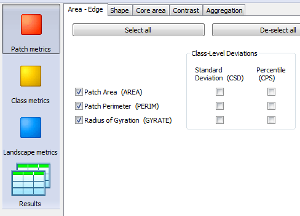
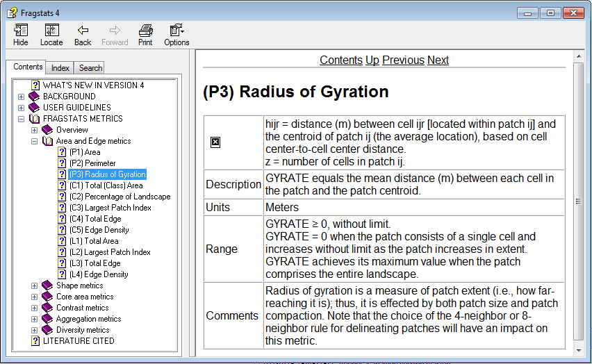
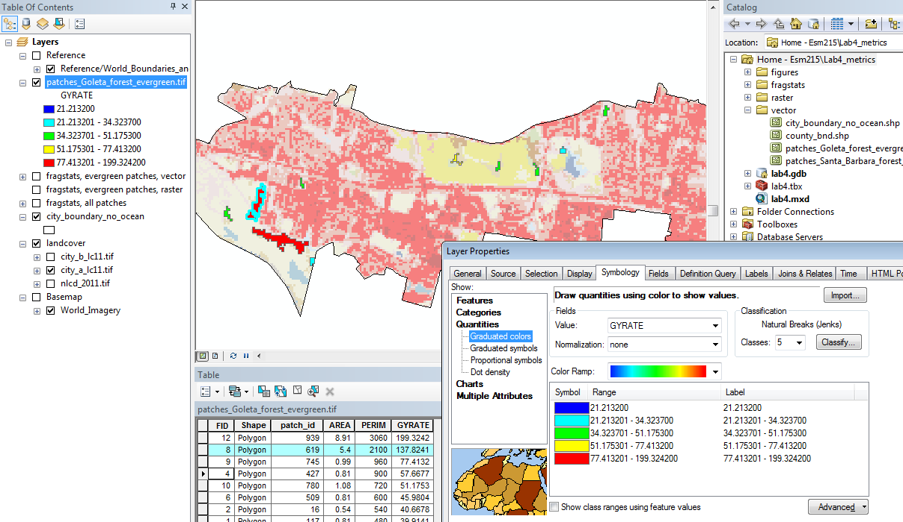

Due: noon Wed, Feb 4 2015 via GauchoSpace

# Introduction {-}

In this lab, you'll explore a variety of metrics used to quantify landscape ecology patterns, per the "patch mosaic paradigm". To get a feel for these metrics, you'll compare patterns between 2 cities in Santa Barbara County and focus on a specific landcover class.

Most of these metrics can be calculated at the level of the individual patch, in aggregate for all patches of a certain class or for all patches in every class for the entire extent of the landscape.

- **Patch** - set of cells having the same class values connected by either 8 (default) or 4 neighbors

- **Class** - all patches having the same landcover value

- **Landscape** - all patches of all classess

For the purpose of this lab, the most interesting metrics are at the Class level, eg for all evergreen forest patches found in the given city, which as the extent represents the landscape. It is also interesting to visualize some of the metrics at the individual Patch level to get a feel for how the size, shape and spacing of patches is quantified by the metrics. The overall Landscape level as computed by FragStats for this lab's data is much less interesting, since it is inclusive of all landcover types and patches.

You will explore the following broad categories of metrics as made available in FragStats (descriptions extracted from help manual):

- **Area and Edge** are the simplest measures of a patch. At the class and landscape levels, these can be summarized with basic statistics (e.g., mean, median, max, variance, etc.). Also included is the patch _radius of gyration_, which can be considered the average distance an organism can move within a patch before encountering the patch boundary from a random starting point. When summarized for the class or landscape as a whole using an area-weighted mean, this metric is also known as _correlation length_ and gives the distance that one might expect to traverse the map while staying in a particular patch, from a random starting point and moving in a random direction.

- **Shape**, whether simple and compact or irregular and convoluted, is difficult to capture, so generally index overall shape complexity rather than attempt to assign a value to each unique shape or morphology. The most common measures of shape complexity are based on the relative amount of perimeter per unit area, usually indexed in terms of a _perimeter-to-area ratio_, or as a _fractal dimension_, and often standardized to a simple Euclidean shape (e.g., circle or square). In general, higher values mean greater shape complexity or greater departure from simple Euclidean geometry.

- **Core area** refers to the interior area of patches after a user-specified _edge buffer_ is eliminated. The edge buffer represents the distance at which the "core" or interior of a patch is unaffected by the edge of the patch. This "edge effect" distance is defined by the user to be relevant to the phenomenon under consideration and can either be treated as fixed or adjusted for each unique edge type. Core area integrates patch size, shape, and edge effect distance into a single measure. All else equal, smaller patches with greater shape complexity have less core area. Most metrics associated with patch area (e.g., mean patch size and variability) can be formulated in terms of core area.

- **Contrast** refers to the relative difference among patch types (ie classes). For example, mature forest next to young forest might have a lower-contrast edge than mature forest adjacent to open field, depending on how the notion of contrast is defined. This can be computed as a contrast-weighted edge density, where each type of edge (i.e., between each pair of patch types) is assigned a contrast weight. Alternatively, this can be computed as a neighborhood contrast index, where the mean contrast between the focal patch and all patches within a user-specified neighborhood is computed based on assigned contrast weights. Note, contrast is an attribute of the edge itself, whereas core area is an attribute of the patch interior after accounting for adverse edge effects that penetrate into patches (and thus have a corresponding depth-of-edge effect).

- **Aggregation** refers to the degree of aggregation or clumping of patch types. Aggregation is an umbrella term used to describe several closely related concepts: 1) dispersion, 2) interspersion, 3) _subdivision_, and 4) _isolation_. Each of these concepts relates to the broader concept of aggregation, but is distinct from the others in subtle but important ways. Aggregation metrics deal variously with the spatial properties of dispersion and interspersion. _Dispersion_ refers to the spatial distribution of a patch type (i.e., how spread out or disperse it is) without explicit reference to any other patch types. _Interspersion_ refers to the spatial intermixing of different patch types without explicit reference to the dispersion of any patch type. In the real world, however, these properties are often correlated. Not surprisingly, therefore, some aggregation metrics deal with dispersion solely, others deal with interspersion solely, and others deal with both, and thus there are a bewildering variety of metrics in this group. Many of the metrics in this group are derived from the _cell adjacency matrix_, in which the adjacency of patch types is first summarized in an adjacency or co-occurrence matrix, which shows the frequency with which different pairs of patch types (including like adjacencies between the same patch type) appear side-by-side on the map.

- **Diversity** measures are influenced by 2 components: richness and evenness. _Richness_ refers to the number of patch types present; _evenness_ refers to the distribution of area among different types. Richness and evenness are generally referred to as the compositional and structural components of diversity, respectively. Some indices (e.g., _Shannon's diversity index_) are more sensitive to richness than evenness. Thus, rare patch types have a disproportionately large influence on the magnitude of the index. Other indices (e.g., _Simpson's diversity index_) are relatively less sensitive to richness and thus place more weight on the common patch types.

The overall steps are to:

1. _Prepare_ data in **R**: crop landcover raster to chosen cities, plot maps and report landcover cell counts.

1. _Calculate_ metrics in **FragStats**: generate patches from cropped city landcover rasters and calculate metrics.

1. _Summarize_ metrics in **R**: output table of class metrics comparing cities, generate patches shapefile from FragStats patch id raster, join with patch metrics table and plot maps per patch metric.

1. _Investigate_ results in **ArcMap** (optional): interactively explore patch metrics.

Instructions for your writeup are at the bottom of this document.

# Download Zip

Download **`lab4_metrics.7z`** from GauchoSpace into your course home directory (eg `H:\esm215`). Right-click on the file -> 7-Zip -> Extract Here. Navigate into the newly expanded `lab4_metrics` folder with Windows Explorer.

# Prepare Data in R

Right-click on **`lab4.Rmd`** -> Open with... -> RStudio.

Set the working directory **`wd`** variable in the first R code chunk below to wherever you extracted the lab4_metrics.z file. If you're copying the path from the address bar of Windows Explorer (recommended to avoid misspellings), you'll need to replace Windows backslashes `\` with R friendly forward slashes `/`.

Once you set the working directory, you should be able to run all the R code via the `Knit HTML` button which "knits": a) the results from executing the chunks of **R code**, and b) the normal text input as **markdown**, a text only language for rendering formatted text (headers, bold, lists, links, tables, etc). For more details, see [rmarkdown.rstudio.com](http://rmarkdown.rstudio.com).

The rest of the R code will crop the landcover data to the city limits and generate an output raster to be used by FragStats. It will also produce landcover maps and landcover cell count summaries for the chosen cities.

You can initially run the code with the default cities, Santa Barbara and Goleta, to see the expected output for the remainder of the lab and ensure the basics work. Then substitute with alternative city names (see table below for exact spelling). You'll need to choose two cities other than the default combination of Santa Barbara and Goleta, although including either with another is fine.

```{r set variables}
# set working directory
wd = 'H:/esm215/lab4_metrics'

# set city name. If city names are in alphabetical order,
#   ie city_b later in alphabetical sort than city_b,
#   then the tables will consistently line up.
city_a = 'Goleta' 
city_b = 'Santa Barbara'

# set landcover code used to generate patches and merge metrics
patches_class = 'forest_evergreen'
```

Before you run the R code, you'll need to ensure ArcMap and Fragstats are closed and not locking the files, otherwise you may get the following error:
    
    cannot delete existing file. permission denied.

## Read County Data {-}

```{r read landcover data, fig.keep='last', eval=T, echo=F}

# ensure raster package of at least version 2.3-12 is installed
if (installed.packages()['raster','Version'] < '2.3-12'){
  message('Your raster package needs to be updated...')
  if ('package:raster' %in% search()) detach('package:raster', unload=TRUE)
  install.packages('raster')
}

# ensure tidyr package of at least version 2.0 is installed
if (installed.packages()['tidyr','Version'] < '0.2.0'){
  message('Your tidyr package needs to be updated...')
  if ('package:tidyr' %in% search()) detach('package:tidyr', unload=TRUE)
  install.packages('tidyr')
}


# load necessary libraries having useful functions, suppressing startup messages and warnings
suppressPackageStartupMessages(suppressWarnings({
  library(reshape) # reshaping functions: rename
  library(rgdal)   # read/write raster/vector data
  library(raster)  # raster functions
  library(rgeos)   # vector functions
  library(knitr)   # knitting functions: kable
  library(dplyr)   # dataframe functions: select, %>%
  library(tidyr)   # reshaping functions: gather
  library(stringr) # string functions: trim spaces
  library(ggplot2) # plotting functions
  }))

# Set working directory
setwd(wd)

# read in landcover rasters, relative to working directory
nlcd_2011 = raster('raster/nlcd_2011.tif')

# read in city boundary vectors
cities = readOGR('vector', 'city_boundary_no_ocean', verbose=F)

# project, aka transform, into same coordinate system as NLCD
cities_aea = spTransform(cities, crs(nlcd_2011))

# plot landcover and projected cities on top
plot(nlcd_2011)
plot(cities_aea, border='black', lwd=2, add=T)
lbls = polygonsLabel(cities_aea, cities_aea@data$CITY, 'centroid', cex=1, doPlot=T, col='darkblue')
```

Here are the available cities in Santa Barbara County.

```{r render table of cities, results='asis', eval=T, echo=F}
# knit table (kable) of available city values
kable(cities_aea@data[,'CITY', drop=F], row.names=F)
```


## Crop to Cities {-}

The rest of the lab is premised on choosing 2 cities (labeled `*_a` and `*_b` in code), so that we can zoom into a smaller area with mixed use. We'll use "Santa Barbara" (a) and "Buellton" (b) for demonstration purposes for the rest of the lab, and you'll choose a different combination of cities to similarly evaluate landcover metrics.


### City A: `r city_a` {-}

```{r crop city a, fig.keep='last', eval=T, echo=F}
setwd(wd)

# select city a, extract polygon and get bounding box
poly_a = cities_aea[cities_aea@data$CITY == city_a,]
bbox_a = bbox(poly_a)

# crop and mask landcover to the city
lc11_a = mask(crop(nlcd_2011, poly_a), poly_a)

# apply original color table to city landcover
lc11_a@legend@colortable = nlcd_2011@legend@colortable

# write to filesystem
writeRaster(lc11_a, 'raster/city_a_lc11.tif', overwrite=T)

# plot
plot(lc11_a)

# add legend
add_legend = function(r, title=NULL, ref=nlcd_2011, lut='raster/nlcd_code2class.csv'){
  d = read.csv(lut)
  d$class = sprintf('%s - %d', d$class, d$code)
  d$colors = ref@legend@colortable[d$code+1]
  idx = d$code %in% freq(r)[,'value']
  legend(x='bottomleft', legend=d$class[idx] , fill=d$colors[idx], cex=0.7, bg='white', title=title)
}
add_legend(lc11_a, sprintf('%s 2011', city_a))
```


### City B: `r city_b` {-}

```{r crop city b, fig.keep='last', eval=T, echo=F}
setwd(wd)

# select city b, extract polygon and get bounding box
poly_b = cities_aea[cities_aea@data$CITY == city_b,]
bbox_b = bbox(poly_b)

# crop and mask landcover to the city
lc11_b = mask(crop(nlcd_2011, poly_b), poly_b)

# apply original color table to city landcover
lc11_b@legend@colortable = nlcd_2011@legend@colortable

# write to filesystem
writeRaster(lc11_b, 'raster/city_b_lc11.tif', overwrite=T, verbose=F)

# plot
plot(lc11_b)
add_legend(lc11_b, sprintf('%s 2011', city_b))
```

## Summarize Class Frequency {-}

Let's look at how many cells there are of each landcover type for both cities. When evaluating which landcover class to inspect patches, you'll need to choose one that exists in both cities.


```{r summarize class frequency, results='asis', eval=T, echo=F}
setwd(wd)
lut='raster/nlcd_code2class.csv'

cl = merge(
  read.csv(lut) %>%
    select(code, class=name, description=class),
  freq(lc11_a) %>% as.data.frame() %>%
    select(code=value, cells_a=count) %>%
    merge(
      freq(lc11_b) %>% as.data.frame() %>%
        select(code=value, cells_b=count),
      by='code', all=T),  
    by='code') %>%
  rename(c(cells_a=city_a, cells_b=city_b))

patches_code = subset(cl, class==patches_class, code, drop=T)

kable(cl)
```

## Create FragStats Tables {-}

The following R code writes tables used as optional input files in FragStats:

- **Descriptors** file provides landcover names to pixel values, and whether a given pixel is considered background.

- **Contrast** file provides values to use in determining the magnitude of edge contrast for each pairwise combination of patch types. Only applicable to specific metrics. Defaulting with highest possible contrast between all patch types (1), but should be edited to something more reasonable.

- **Similarity** file provides values to use in determining the similarity between each pairwise combination of patch types. Only applicable to specific metrics. Defaulting with lowest possible similarity between all patch types (0), but should be edited to something more reasonable.

These are all just comma-seperated value (CSV) files, so you can rename the file extension to *.csv in order to easily edit in Excel.


```{r create fragstats tables, results='asis', eval=T, echo=F}
setwd(wd)
dir.create('fragstats', showWarnings=F)
lc = read.csv('raster/nlcd_code2class.csv')

# class descriptors
d = lc %>%
  select(
    ID = code,
    Name = name) %>%
  mutate(
    Enabled = TRUE,
    IsBackground = FALSE)
d[d$Name=='na',c('Enabled','IsBackground')] = c(FALSE, TRUE)
d[d$Name=='water',c('Enabled','IsBackground')] = c(FALSE, TRUE)
write.csv(d, 'fragstats/descriptors.fcd', row.names=F, quote=F)

# setup file square tables
codes  = subset(d, Enabled==TRUE, ID, drop=T)
cnames = subset(d, Enabled==TRUE, Name, drop=T)
n = length(codes)

fsq_header = sprintf('FSQ_TABLE
# comment lines start with # and are allowed anywhere in the table
# literal class names cannot contain spaces
# the order of rows and column is the one specified in the CLASS_LIST_???????
# two types of class lists are allowed CLASS_LIST_LITERAL() and CLASS_LIST_NUMERIC(), but only the first one encountered is considered
# class names or ids will be compared with the class descriptors in the model and only the matches
CLASS_LIST_LITERAL(%s)
CLASS_LIST_NUMERIC(%s)
', paste(cnames, collapse=', '), paste(codes, collapse=', '))

# similarity
m = matrix(rep(0, n*n), nrow=n, ncol=n, dimnames = list(codes, codes))
diag(m) = 1
cat(fsq_header, file='fragstats/similarity_0.fsq')
write.csv(m, 'fragstats/similarity_0_data.csv', row.names=F, quote=F)
cat(readLines('fragstats/similarity_0_data.csv')[-1], sep='\n', file='fragstats/similarity_0.fsq', append=T)
unlink('fragstats/similarity_0_data.csv')

# contrast
m = matrix(rep(1, n*n), nrow=n, ncol=n, dimnames = list(codes, codes))
diag(m) = 0
cat(fsq_header, file='fragstats/contrast_1.fsq')
write.csv(m, 'fragstats/contrast_1_data.csv', row.names=F, quote=F)
cat(readLines('fragstats/contrast_1_data.csv')[-1], sep='\n', file='fragstats/contrast_1.fsq', append=T)
unlink('fragstats/contrast_1_data.csv')
```

# Calculate Metrics in FragStats

## Parameterize Model {-}

Let's proceed to calculate metrics in Fragstats.

1. Open FragStats (eg via Start Menu and type "FragStats" in Search). Once the application opens, click New.

1. Register landcover rasters per city. Under the left pane Input Layers, click Add layer... GDAL GeoTiff grid (.tif) and browse (...) to the cropped landcover for city "a", `lab4_metric/raster/city_a_lc11.tif` path. Repeat for your comparison city "b".

    
    
    Note that if you change cities, you will need to Remove all layers and Add layer... again in order to register the correct number of rows and columns. Otherwise the patches might get truncated to a smaller boxed area.

1. Switch to the Analysis Parameters in the left pane. Select all the available levels for Sampling strategy and to generate the patch ID file. 
Tick the Automatically save results option and point to the `lab4_metrics\fragstats` folder with the `model01` (note `0`=zero) filename prefix (to be read later in R).

    

1. Parameterize Common Tables. Use the prepped common tables from above and a fixed depth of 60m (~ 2 cells) to start.

    

1. Choose some initial metrics, like the following:

    - Patch metrics, Area - Edge: AREA, PERIM, GYRATE
    - Class metrics, Area - Edge: CA/TA, PLAND, LPI
    - Landscape metrics, Area - Edge: CA/TA, LPI
    
    Note that some metrics require parameters, such as Aggregation metrics requiring a Search Radius. If you select metrics withing specifying required parameters you'll get an error message in the Activity Log and your run will be terminated without producing any results.

1. Save to file. I chose `H:\esm215\lab4_metrics\fragstats\model01.fca`. You can Save over this file with further changes.

1. Run. Proceed. Look for any errors in the Activity Log. You'll need to see that it output the patch id file to proceed, eg:

    ```
    Patch ID file saved as: H:\esm215\lab4_metrics\raster\city_a_lc11_id8.tif
    ```

## Read Help {-}

For your assignment you are expected to choose at least 2 metrics from each category (Area and Edge, Shape, Core area, Contrast, Aggregation,Diversity) which corresponds to the tabs available in the metric selection interface of Fragstats.



Notice how the available metrics and full descriptions are navigable by category via Help -> Help Contents.



Unfortunately equations are not appearing in the Help installed on the Bren lab machines (see X in upper left cell of table above). So you can also browse the `fragstats.help.4.2.pdf`.


## Explore Results {-}

Besides being able to browse the Results pane in Fragstats, the following files are output into the fragstats folder with the prefix you specified above to Automatically save results:

- model01**.patch**: patch metrics, each unique patch per row with columns of selected patch metrics
- model01**.class**: class metrics, each unique landcover class per row with columns of selected class metrics 
- model01**.land**: landscape metrics, just one row for all patches across all metrics with columns of selected landscape metrics
- model01**.adj**: class adjacency matrix, pair-wise counts of class edges shared

These are all CSV files, which have a landscape ID (LID) column corresponding to each available landscape, ie city "a" or "b". You will use these files to summarize class level results into table using R and explore spatially at the patch level in ArcMap.

You could also take a look in Excel (although not necessary) by adding a .csv extension to the filename and double-click to open. Or from within Excel, choose the Data tab, From Text, select All files (not just *.txt, *.csv) and navigate to the file (eg fragstats\model01.class), Delimited by comma.

# Summarize Class Metrics as Table in R
    
As long as FragStats generated the class output file `fragstats/model01.class`, the following R code will produce a table of each combination of class and metric by city.

```{r summarize class metrics, results='asis', eval=T, echo=F}
setwd(wd)
f = 'fragstats/model01.class'
if (file.exists(f)){
  read.csv(f) %>%
    mutate(
      city = plyr::revalue(str_trim(basename(as.character(LID))), c(
        'city_a_lc11.tif' = city_a,
        'city_b_lc11.tif' = city_b))) %>%
    select(-LID, city, TYPE, (TYPE+1):(city-1)) %>% # head
    gather(variable, value, -city, -TYPE) %>%
    spread(city, value) %>%
    plyr::rename(c('TYPE'='class', 'variable'='metric')) %>%
    # filter(str_trim(class) == patches_class) %>%
  kable()
}
```

Note that you can uncomment (ie remove `#` from beginning of line) the line of code above to filter the table to just the chosen patches class.

```r
filter(str_trim(class) == patches_class) %>%
```

# Display Patch Metrics as Maps in R

As long as FragStats generated the patch output file `fragstats/model01.patch`, the following R code should output:

- patch polygons per city, eg:

    - `vector\patches_Goleta_forest_evergreen.shp`
    - `vector\patches_Santa_Barbara_forest_evergreen.shp`

- maps displayed below per Patch metric selected in FragStats

```{r generate patch polygons, eval=T, echo=F, fig.show='hold'}
setwd(wd)
f = 'fragstats/model01.patch'
if (file.exists(f)){
  
  # get patch metric data
  d = read.csv(f) %>%
    filter(str_trim(TYPE)==patches_class) %>%
    mutate(
      city = plyr::revalue(str_trim(basename(as.character(LID))), c(
        'city_a_lc11.tif' = city_a,
        'city_b_lc11.tif' = city_b))) %>%
    select(-LID, city, PID, (TYPE+1):(city-1))
  
  
  # define function for getting patches per city  
  get_patches = function(path_lc, path_id, city_s){
  
    # extract patches
    r_lc = raster(path_lc)
    r_p = raster(path_id)
    r_p = crop(extend(shift(r_p, 30), r_lc), r_lc)
    r_p[r_lc != patches_code | r_p == -999] = NA
    names(r_p) = 'patch_id'
    p = rasterToPolygons(r_p, dissolve=T)
  
    # merge patch data to polygon attribute table
    p@data = p@data %>%
      left_join(
        d %>% 
          filter(city==city_s) %>%
          select(-city) %>%
          plyr::rename(c('PID'='patch_id')),
        by='patch_id')
  
    # write to shapefile
    writeOGR(
      p, 'vector', 
      sprintf('patches_%s_%s', str_replace_all(city_s, ' ', '_'), patches_class), 
      'ESRI Shapefile', overwrite_layer=T)
  
    # prep data
    pts = fortify(p, region='patch_id')
    df  = merge(pts, p@data, by.x='id', by.y='patch_id', all.x=T)
    return(df)
  }

  patches_a = get_patches(
    'raster/city_a_lc11.tif',
    'raster/city_a_lc11_id8.tif',
    city_a)

  patches_b = get_patches(
    'raster/city_b_lc11.tif',
    'raster/city_b_lc11_id8.tif',
    city_b)
  
  # define function for plotting metrics
  plot_metric = function(df, column, title){  
    ggplot(df) + 
      aes_string('long','lat',group='group',fill=column) + 
      geom_polygon() +
      geom_path(size=0.1, color='white') +
      coord_equal() +
      scale_x_continuous(breaks=NULL) +
      scale_y_continuous(breaks=NULL) +
      theme(axis.title.x = element_blank(), axis.title.y = element_blank()) +
      scale_fill_continuous(low='blue',high='red') +
      ggtitle(title)
  }

  for (metric in setdiff(names(d), c('city','PID'))){
    print(plot_metric(patches_a, metric, city_a))
    print(plot_metric(patches_b, metric, city_b))
  }

}
```

# Explore Patch Metrics Spatially in ArcMap

Now you can interactively explore the patch shapefiles generated in the previous step (`vector\patches_[city]_[class].shp`) from within ArcMap.

You can add the shapefile to your map by simply dragging it over from your Catalog pane into your data frame (or use the Add Data + button).

In order to visualize difference in patch metrics you'll want to change the **Symbology** of the layer(right-click on layer in Table of Contents -> Properties, Symbology tab) to Quantities, Graduated Colors and choose the Value of interest. Here's an example of looking at GYRATE values in Goleta patches of evergreen forest.



Note how you can right-click on a given layer in the Table of Contents and select:

- **Properties** to set Symbology, see Source and more.

- **Zoom to Layer** to zoom the data frame to the extent of the layer.

- **Open Attribute Table** to pull up the data for that layer. You can further select a row and see it highlighted in turquoise in the table and spatially in the map data frame. You can further right click on the left most record selector (arrow like play button) and Flash to show where the patch is or Zoom to Selected.

The screenshot above also shows landcover for the city with **Transparency** at 50% (right-click on layer city_a_lc11.tif or group landcover, Display tab). This makes the patches pop more visually, while still seeing neighboring landcover types, which affects the Contrast metrics.

# Assignment {-}

Your assignment is to report on the metric differences between cities for a chosen class (ie `patches_class`) at both the class and patch level. (The landscape level is uninformative for this lab).

You must choose at least two metrics (one at patch level, and one at class level) from each of the metric categories:

- Area and Edge
- Shape
- Core area
- Contrast
- Aggregation
- Diversity

You're encouraged to tweak parameters, including the Common Tables. You can generate your writeup as either an HTML file rendered from a reduced version of this lab4.Rmd (leave code but remove extraneous text with lab directions) or more simply as a Word document. Include:

- table of class metrics by row and city by column as produced above, but for only the landcover class of your choice (not all classes, accomplished by uncommenting line of code mentioned above),

- maps of patch metrics chosen (displayed above),

- description of each of the chosen metrics in your own words, and

- comments on comparing cities for class metrics and betwen patches for patch metrics.
