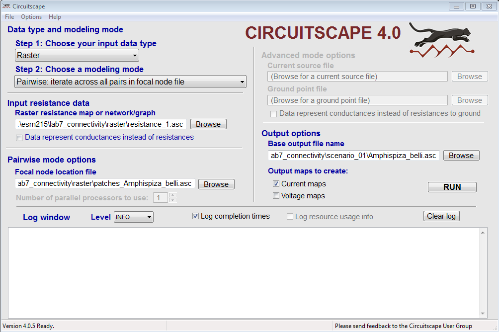

  
Due: 5pm Fri, Feb 27 2015 via GauchoSpace

# Introduction {-}

In this lab, you'll explore connectivity between species habitat patches using the software program CircuitScape. CircuitScape evaluates connectivity on a landscape based on two inputs:

- **Patches**: raster uniquely identifying species habitat patches, which get used as the pairwise nodes in a graph between which connectivity is evaluated.

- **Resistance surface**: a raster describing resistance between patches, ie the "matrix", describing difficulty in movement across the terrain for species dispersal.

You'll create patches from the previous species distribution model outputs and then run and evaluate CircuitScape outputs using different resistance surfaces.

# Download and Set Variables

After downloading lab7_connectivity.z to your course directory (eg `H:\esm215`). Right-click on lab7_connectivity.z -> 7-Zip -> Extract Here. Be sure that you have a folder like `H:\esm215\lab7_connectivity` containing lab7.Rmd. Right-click on lab7.Rmd ->  Open with -> RStudio.

Set your working directory and scientific species names in R chunk below and Knit the document to generate patches and resistance surfaces.

```{r set_wd_sp}
wd            = 'H:/esm215/lab7_connectivity'
sp_scientific = 'Amphispiza belli'
```

# Create Patches

To describe patches you'll use the habitat from the previous species distribution lab for Santa Barbara County's current climate, which relative to this lab's working directory should be up one folder and in the scenario_04 subfolder: `../lab6_species/scenario_04/*_current_0.5min_sb.bil`. You will need to have this output generated before proceeding.

As long as the file `../lab6_species/scenario_04/*_current_0.5min_sb.bil` exists (where `*` is substituted with your species scientific name, spaces substituted with `_`), then the next R chunk should generate the following outputs:

- **raster** of patch ids `raster/patches_*.asc` (where `*` is your scientific species name)
- **vector** polygons having patch id `vector/patches_*.asc`

The patches are generated by applying a the threshold from the species distribution model output that generates 10% habitat (`pct_land = 0.10`). Patches are dropped that have less than the minimum number of cells (`min_cells = 4`).

```{r create_patches, eval=T, echo=F}

# load libraries
suppressPackageStartupMessages(suppressWarnings({
  library(sp)
  library(rgdal)
  library(raster)
  library(stringr)
  library(dplyr)
  library(tidyr)  
  library(knitr)
  library(RColorBrewer)
  library(gdistance)
}))

# set working directory
setwd(wd)

# input species variables
sp_nospace = str_replace(sp_scientific, ' ', '_')
sp_bil     = sprintf('%s/../lab6_species/scenario_04/%s_current_0.5min_sb.bil', wd, sp_nospace)

# output species patches as raster and vector
asc_patches        = sprintf('%s/raster/patches_%s.asc', wd, sp_nospace)
ply_patches        = sprintf('%s/vector/patches_%s', wd, sp_nospace)

# inputs for resistance surfaces
asc_nlcd           = sprintf('%s/raster/nlcd.asc', wd)
csv_nlcd           = sprintf('%s/raster/nlcd_resistance.csv', wd)
ply_roads          = sprintf('%s/vector/roads', wd)
pt_underpass       = sprintf('%s/vector/underpass.txt', wd)

# output resistance surfaces as raster
asc_res_1          = sprintf('%s/raster/resistance_1.asc', wd)
asc_res_nlcd       = sprintf('%s/raster/resistance_nlcd.asc', wd )
asc_res_nlcd_roads = sprintf('%s/raster/resistance_nlcd_roads.asc', wd)
asc_res_species    = sprintf('%s/raster/resistance_%s.asc', wd, sp_nospace)
asc_res_underpass    = sprintf('%s/raster/resistance_nlcd_roads_underpass.asc', wd)

# raster variables
crs_gcs = '+proj=longlat +datum=WGS84'
jet_colors = colorRampPalette(
  c("#00007F", "blue", "#007FFF", "cyan",
    "#7FFF7F", "yellow", "#FF7F00", "red", "#7F0000"))(256)
alpha = function(colors, alpha=0.2){
  apply(sapply(colors, col2rgb)/255, 2, 
        function(x) rgb(x[1], x[2], x[3], alpha=alpha))
}

# patch generation parameters
pct_land   = 0.10
min_cells  = 4

if (file.exists(sp_bil)){
  
  if (!file.exists(asc_patches)){  
    
    # read continuous species raster
    r_sp      = raster(sp_bil, crs=crs_gcs)  
    
    # determine threshold to arrive at pct_land
    d = data.frame(
      prob_encounter = getValues(r_sp),
      area_cell_km2  = getValues(area(r_sp))) %>%
      arrange(desc(prob_encounter)) %>%
      na.omit() %>%
      mutate(area_cum_km2 = cumsum(area_cell_km2)) %>%  
      mutate(area_pct = area_cum_km2 / last(area_cum_km2))    
    i = which.max(d$area_pct > pct_land)
    n = nrow(d)
    threshold = d$prob_encounter[i]
    
    # r_b: binary raster
    r_b = r_sp >= threshold
    r_b[r_b==F] = NA
    
    # r_p: patch raster
    r_p = clump(r_b, directions=8)
    d_p = freq(r_p) %>%
      as.data.frame() %>%
      arrange(count) %>%
      filter(count >= min_cells & !is.na(value))
    r_p[!r_p %in% d_p$value] = NA
    writeRaster(r_p, asc_patches, overwrite=T)  
    
    # raster to polygons
    ply_p = rasterToPolygons(r_p, dissolve=T)
    names(ply_p) = 'patch'
    writeOGR(ply_p, dirname(ply_patches), basename(ply_patches), driver='ESRI Shapefile')    
  } else {
    r_p   = raster(asc_patches, crs=crs_gcs)
    ply_p = readOGR(dirname(ply_patches), basename(ply_patches), verbose=F)
  }
  
  # plot
  plot(raster(asc_patches), col=jet_colors)
  
} else {
  cat(sprintf('Patches not generated because not finding species distribution model output:\n    %s\n', sp_bil))
}
```  

# Create Resistance Surfaces 

The simplest resistance surface is to apply a constant value to every cell. The resistances between patches would then be proportional to Euclidean distance, since crossing any given cell incurs the same cost.

A common approach to creating resistance surfaces is to convert landcover to some biologically relevant resistance values. You'll use the following table from [Theobald (2012)](http://onlinelibrary.wiley.com/doi/10.1111/j.1755-263X.2011.00218.x/full) ranging from null (0) to highest (100) resistance:

```{r table_nlcd_resistances, results='asis', echo=F}
read.csv(csv_nlcd) %>%
  select(code, nlcd_class, resistance) %>%
  kable()
```

A common major obstacle is roads. The major roads (freeways and highways) have been extracted to vector/roads.shp. These get converted to raster and "burned" into the NLCD converted raster with a value of 100.

The final resistance surfaces to be generated by the following R chunk are:

- `resistance_1.asc`: resistance of 1 throughout landscape, similar to basic Euclidean distance

- `resistance_nlcd.asc`: resistance using the conversion from NLCD landcover to resistance values per [Theobald (2012)](http://onlinelibrary.wiley.com/doi/10.1111/j.1755-263X.2011.00218.x/full)

- `resistance_nlcd_roads.asc`: roads burnt with a value of 100 into the NLCD converted resistance surface

```{r create_resistances, echo=F}

# generate rasters if don't exist
if (!all(file.exists(c(
  asc_res_nlcd, asc_res_1, asc_res_nlcd_roads)))){

  # read nlcd
  r_nlcd = raster(asc_nlcd)
  
  # read table: nlcd landcover code to resistance values
  d_x = read.csv(csv_nlcd)  
  m_x = d_x %>%
    mutate(x = round(resistance)) %>%
    select(code, x) %>%
    as.matrix
  
  # reclassify nlcd to resistance
  r_x = reclassify(r_nlcd, m_x)
  r_x[r_x==0] = NA
  writeRaster(r_x, asc_res_nlcd, overwrite=T)
    
  # resistance 1
  r_x1 = mask(setValues(r_x, 1), r_x)
  writeRaster(r_x1, asc_res_1, overwrite=T)
  
  # add roads to nlcd
  lns_roads = readOGR(dirname(ply_roads), basename(ply_roads), verbose=F)
  r_roads = rasterize(lns_roads, r_x, 100)                    
  r_nlcd_roads = cover(r_roads, r_x)
  writeRaster(r_nlcd_roads, asc_res_nlcd_roads, overwrite=T) 
}

plot(raster(asc_res_1), col=jet_colors, main='resistance: 1')
plot(raster(asc_res_nlcd), col=jet_colors, main='resistance: nlcd')
plot(raster(asc_res_nlcd_roads), col=jet_colors, main='resistance: nlcd + roads')
```

**Question:** In the code above, the roads shapefile gets converted to raster (with `rasterize`) and then "burned" into the NLCD resistance raster with the `cover` function from the raster library. Does the sequence of arguments matter with this function, and if so why? _Lookup the help from this function (F1 with cursor in the function name of the editor, or type `?cover` in Console) and try plotting the different inputs (eg `plot(r_roads)`) after running Chunks -> Run All, then selecting and running just that section of code._

Yes, the "cover" function overlays one raster on top of another. We must first rasterize the road shapefile before the cover function will merge it with the land cover data. 

# Circuitscape on Uniform 1 Resistance [scenario_01]

Now that you have the inputs prepared, you're ready to run Circuitscape, which you can launch from the Start menu -> All Programs -> Science Apps -> Circuitscape. Parameterize this first scenario like so:

- Step 1: Raster

- Step 2: Pairwise

- Raster resistance: `raster\resistance_1.asc`

- Focal node location: `raster\patches_Amphispiza_belli.asc`

- Base output: `scenario_01\*.out` where `*` is the scientific name of your species, with space replaced by underscore. You can create this folder first and browse to it, or type it into the location textbox and Circuitscape will create the scenario_01 folder for you and place all the outputs in that folder, prefixed by the species name.

- Output maps: X Current maps

Here's what the interface looks like for `sp_scientific = 'Amphispiza belli'`:



When you click on Run you should see Circuitscape iterate through calculating resistance for each patch to patch combination.

The next R chunk will read in the output of the cumulative current.

```{r plot_scenario_01, eval=T, echo=F}
plot_patches_raster = function(
  asc, patches_gray=T, patches_label=T, raster_alpha=1, extent=NULL, patch_ids=NULL, extent_threshold=NA){
  
  if (!file.exists(asc)){
    cat(sprintf('The plot was not generated because not finding input raster:\n    %s\n', asc))
    return()
  }
  
  if (!file.exists(asc_patches)){
    cat(sprintf('The plot was not generated because not finding asc_patches:\n    %s\n', asc_patches))
    return()
  }

  if (!file.exists(sprintf('%s.shp', ply_patches))){
    cat(sprintf('The plot was not generated because not finding polygons of patches ply_patches:\n    %s.shp\n', ply_patches))
    return()
  }
  
  # read patches
  ply_p  = readOGR(dirname(ply_patches), basename(ply_patches), verbose=F)
  cols_p = colorRampPalette(brewer.pal(9, 'Set1'))(length(ply_p)) 
  r_p    = raster(asc_patches)
  
  # set patch_ids
  if (!is.null(patch_ids)){
    ply_p = subset(ply_p, patch %in% patch_ids)
  } else {
    patch_ids = ply_p@data$patch
  }
  
  # read raster output
  title = sprintf('%s/%s', basename(dirname(asc)), basename(tools::file_path_sans_ext(asc)))  
  r = mask(raster(asc, crs=crs_gcs), r_p %in% patch_ids, maskvalue=1)
  if (!is.na(extent_threshold)){ # extent_threshold = 0.02
    r = crop(r, trim(r < extent_threshold, values=1))
  }
  if (!is.null(extent)){
    r = crop(r, extent)
  }    
  plot(r, col=alpha(jet_colors, raster_alpha), main=title)
    
  # plot patches
  if (patches_gray){
    plot(ply_p, col='gray', border=NA, add=T)
  } else {
    plot(ply_p, border=NA, add=T, col=cols_p)
  }
  if (patches_label){ text(coordinates(ply_p), labels=ply_p$patch, cex=0.5) }    
}
asc = sprintf('%s/scenario_01/%s_cum_curmap.asc', wd, sp_nospace)
plot_patches_raster(asc)
```

# Circuitscape on NLCD Converted Resistance [scenario_02]

Now look at resistance using the NLCD converted surface that spatially varies. Parameterize just like the previous scenario except:

- Raster resistance: `raster\resistance_nlcd.asc`

- Base output: `scenario_02\*.out` where `*` is the scientific name of your species, with space replaced by underscore.

```{r plot_scenario_02, eval=T, echo=F}
asc = sprintf('%s/scenario_02/%s_cum_curmap.asc', wd, sp_nospace)
plot_patches_raster(asc)
```

# Circuitscape on NLCD + Road Resistance [scenario_03]

Now look at resistance using the NLCD converted surface that spatially varies. Parameterize just like the previous scenario except:

- Raster resistance: `raster\resistance_nlcd_roads.asc`

- Base output: `scenario_03\*.out` where `*` is the scientific name of your species, with space replaced by underscore.

```{r plot_scenario_03, eval=T, echo=F}
asc = sprintf('%s/scenario_03/%s_cum_curmap.asc', wd, sp_nospace)
plot_patches_raster(asc)
```

# Circuitscape on Resistance with Underpass [scenario_04]

A sensible strategy for increasing connectivity of habitat patches for a terrestrial mobile animal is to identify the most significant barrier, such as a road, and restore, or drastically lower the resistance, of that barrier, such as with an underpass.

## Locate Underpass

Let's try this by interactively identifying a road pixel on the previous road resistance surface. In order to see the map well, you'll want to first resize the Plots window so it takes up the majority of the screen vertically and horizontally. For the interactive drawing of the point underpass to work, you'll want to go to the RStudio menu Code -> Run Region -> Run All (or Ctrl+Alt+R keyboard shortcut) so the R code is run from the Console. _(Note: Knitting the R Markdown document is not interactive.)_ Try to pick a point with only 1 pixel's road width.

After interactively entering the point of the underpass, it is saved to `vector/underpass.txt` and a resistance surface is also generated with that pixel converted from 100 to 1 resistance `raster/resistance_nlcd_roads_underpass.asc`. (The interactive drawing of the underpass is presented if the file is not found, so you can also delete the file and Ctrl+Alt+R to interactively enter a new underpass point.)

```{r draw_underpass, eval=T, echo=F}

if (interactive() & file.exists(asc_res_nlcd_roads) & !file.exists(pt_underpass)){
  
  plot_patches_raster(asc_res_nlcd_roads)
  
  # pick point
  cat('\n\nPlease pick a point on the road (resistance=100) to convert to an underpass (resistance=1). Note that the resistance surface has a muted color ramp and the habitat patches are drawn in uniquely solid colors with numerical labels on top. TIP: You may want to resize the Plots window in RStudio to see the map better.\n')
  pt_v = 0
  r_x = raster(asc_res_nlcd_roads)
  while (pt_v != 100){
    pt = SpatialPoints(locator(1))
    # update point to center of cell
    pt = xyFromCell(r_x, cellFromXY(r_x, pt), spatial=T)
    if (raster::extract(r_x, pt) == 100){      
      break
    } else {
      cat('Sorry resistance value not 100, ie not road. Please pick another point.')
    }
  }
  
  # write underpass point
  dir.create('scenario_04', showWarnings=F)
  dput(pt, file=pt_underpass)
  
  # write resistance with underpass cell converted to 1
  r_c = r_x
  r_c[cellFromXY(r_c, pt)] = 1
  writeRaster(r_c, asc_res_underpass, overwrite=T)
}

if (file.exists(asc_res_underpass) & file.exists(pt_underpass)){
  
  # read underpass point
  pt = dget(pt_underpass)
  
  # plot patches prominent, underpass resistance muted
  plot_patches_raster(asc_res_underpass, patches_gray=F, raster_alpha=0.2)
  points(pt, col='red', lwd=2, pch='X')  
}
```

## Run Circuitscape

Next, you'll want to run Circuitscape as before, except on this new resistance surface with the underpass and output to a new scenario_04 folder:

- Raster resistance: `raster\resistance_nlcd_roads_underpass.asc`

- Base output: `scenario_04\*.out` where `*` is the scientific name of your species, with space replaced by underscore.

```{r plot_scenario_04, eval=T, echo=F}
asc = sprintf('%s/scenario_04/%s_cum_curmap.asc', wd, sp_nospace)
plot_patches_raster(asc)
if (exists('pt') & length(getHook('plot.new'))>0) points(pt, col='red', lwd=1, pch='X')
```

## Evaluate Between Patches

Choose two nearby patches on either side of the underpass and enter their numeric ids as the `patches` variable in the R chunk below. The rest of the R chunk will extract the Circuitscape current map between those two patches, zoomed into the extent inclusive of all values 0.02 or higher. The red X denotes the point location of the underpass before (scenario_03) and after (scenario_04) implementation. The red line is the least cost path between patch label points.

```{r plot_patches, eval=T, echo=F}
patches = c(15, 25)

patches_sfx = paste(sort(patches), collapse='_')
asc_03 = sprintf('scenario_03/%s_curmap_%s.asc', sp_nospace, patches_sfx)
asc_04 = sprintf('scenario_04/%s_curmap_%s.asc', sp_nospace, patches_sfx)
if (file.exists(asc_03) & file.exists(asc_04) & exists('pt')){
  cur_03 = raster::extract(raster(asc_03), pt)
  cur_04 = raster::extract(raster(asc_04), pt)
} else {
  cur_03 = NA
  cur_04 = NA
}

if (exists('pt') & file.exists(asc_03) && exists('ply_p') && all(patches %in% ply_p@data$patch)){

  # get extent of raster with current between patches, trimmed to values >= 0.02
  r_p  = raster(asc_patches)
  r_03 = mask(raster(asc_03, crs=crs_gcs), r_p %in% patches, maskvalue=1)
  r_e  = crop(r_03, trim(r_03 >= 0.02, values=0))
  
  # resistance 03
  plot_patches_raster(
    'raster/resistance_nlcd_roads.asc',
    patch_ids = patches, extent=extent(r_e))
  points(pt, col='red', lwd=1, pch='X')
  
  # scenario_03
  plot_patches_raster(
    sprintf('scenario_03/%s_curmap_%s.asc', sp_nospace, patches_sfx),
    patch_ids = patches, extent=extent(r_e))
  points(pt, col='red', lwd=1, pch='X')
  
  # add least cost path
  plot(
    shortestPath(
      geoCorrection(transition(1/raster(asc_res_nlcd_roads), mean, directions=8), type="c"), 
      coordinates(subset(ply_p, patch == min(patches))),
      coordinates(subset(ply_p, patch == max(patches))),
      output='SpatialLines'), add=TRUE, col='red')

  # resistance 04
  plot_patches_raster(
    'raster/resistance_nlcd_roads_underpass.asc',
    patch_ids = patches, extent=extent(r_e))
  points(pt, col='red', lwd=1, pch='X')

  # scenario_04
  plot_patches_raster(
    sprintf('scenario_04/%s_curmap_%s.asc', sp_nospace, patches_sfx),
    patch_ids = patches, extent=extent(r_e))    
  points(pt, col='red', lwd=1, pch='X')
  
    # add least cost path
  plot(
    shortestPath(
      geoCorrection(transition(1/raster(asc_res_underpass), mean, directions=8), type="c"), 
      coordinates(subset(ply_p, patch == min(patches))),
      coordinates(subset(ply_p, patch == max(patches))),
      output='SpatialLines'), add=TRUE, col='red')
}
```

Look at the cumulative resistance between your chosen patches for scenario_03 and scenario_04 in the file `*_resistances_3columns.asc` where `*` is your scientific species name. The three columns correspond with: patch from, patch to, total resistance. Update the table below (ie replace "?" with values from files).

variable                      | scenario_03: without underpass | scenario_04: with underpass
------------------------------|--------------------------------|----------------------------
resistance at underpass point |                            100 | 1
current at underpass point    |                     `r cur_03` | `r cur_04`
resistance between patches    |                              ? | ?

_NOTE: The values for "current at the underpass point" in table above get generated into the knitted output, values set by the R chunk above._

**Question:** Where you added the underpass, how do you expect decreasing the resistance will effect (ie increase or decrease): a) current at that point, b) total resistance between two nearby patches on either side? 

# Assignment {-}

Besides the questions inline above, answer the following discussion questions: 

1. In qualitative terms, briefly describe how Circuitscape works and what the circuitscape current values represent.

1. Based on this limited sample, how might you use circuitscape to identify multi-species corridors for a large number of species?

Include all questions, answers, plots and tables in your final writeup, submitted as either an HTML, Word or PDF document.

# Further Resources {-}

- Bren group project (2005): [Designing Road Crossings for Safe Wildlife Passage](http://www.bren.ucsb.edu/research/documents/corridors_final.pdf)

- [Santa Barbara Wildlife Linkages Project](https://sites.google.com/site/cawildlifelinkagesproject/) (2011)

```{r extra, eval=F, echo=F}
# This chunk is NOT evaluated (eval=F), 
# just some extra code and ideas, 
# possibly to use next time lab is taught.

merge(
  read.table(
    sprintf('scenario_03/%s_resistances_3columns.asc', sp_nospace), 
    sep=' ', col.names=c('patch_from','patch_to','resistance_03')),
  read.table(
    sprintf('scenario_04/%s_resistances_3columns.asc', sp_nospace),
    sep=' ', col.names=c('patch_from','patch_to','resistance_04')),
  by=c('patch_from','patch_to')) %>%
  filter(patch_from==min(patches) & patch_to==max(patches))

# To consider next time:
# - change resistance levels by landcover based on species
# - threshold dispersal (ie max total resistance) and display graph with fewer connections
```