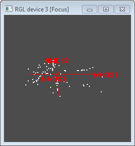
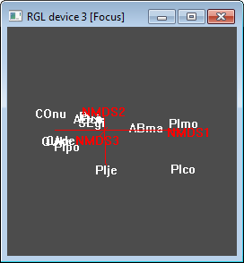
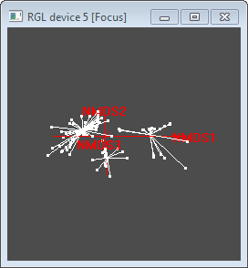

  
Due: 5pm Fri, Mar 6 2015 via GauchoSpace

# Introduction {-}

In this lab you'll explore differences between sites to characterize "communities" based on dissimilarity in species composition and environment. Whittaker (1960) was first to describe species diversity between sites (_beta_; $\beta$ diversity), which is in relation to diversity of the individual (_alpha_; $\alpha$ diversity) and overall region  (_gamma_; $\gamma$ diversity).

You will quantify how "different" sites are from each other based on differences in species composition. This _ecological distance_ between sites then forms the input matrix for an _ordination_ technique that oders the sites along one or more axis so as to maximize the spread of ecological distances. You'll then _cluster_ these sites into similar groups.

Next, you'll look at environmental variation between sites in a few ways. First, you'll overlay _environmental vectors_ in the "species" ordination space to show general trends. Then you'll add _environmental contour_ plots for a couple dominant variables to see how the range of environmental values trends across the sites in species space. Next you'll conduct _recursive partitioning_ to determine how environmental variables predict the groups.

# Set Environment {-}

Set your working directory in the R chunk below.

```{r set_env, eval=T, echo=F}
# set working directory
#wd = '/Users/bbest/github/landscape-ecology/wk08_communities/lab8_communities' # BB's Mac
wd = 'H:/esm215/lab8_communities'
setwd(wd)

# load libraries
if (installed.packages()['dplyr','Version'] < '0.4.1'){
  install.packages('dplyr')
}
suppressPackageStartupMessages(suppressWarnings({
  library(MASS)
  library(mgcv)
  library(nlme)
  library(scatterplot3d)
  library(vegan)
  #library(vegan3d) # uncomment for Mac
  library(rpart)
  library(party)
  library(partykit)
  library(stringr)
  library(sp)
  library(rgdal)
  library(dismo)
  library(dplyr)
  library(tidyr)  
  library(knitr)  
  library(RColorBrewer)
}))
```

# Study Area and Data {-}

You'll use the tree survey data from Sequoia National Park described by Urban et al (2002) from your assigned readings. The survey files in the `data` folder are:

- **env21.csv**: environmental variables measured over 99 samples plots [99 sites X 21 environment variables]
- **spp17.csv**: 17 tree species measured over the 99 sample plots as density (tree stems per hectare) [99 sites X 17 species]
- **plotxy.csv**: the plots with their UTM coordinates (UTM zone 11N) [99 sites X 2 coordinates]

You can find a more detailed description in `data\sequoia_data.pdf`.

Let's start by mapping the study plots (see also Figure 2 from Urban et al, 2002).

```{r map_plots, eval=F, echo=F}
# map of plots
pts_utm = read.csv('data/plotxy.csv')
coordinates(pts_utm) = ~utmE+utmN
proj4string(pts_utm) = CRS('+proj=utm +zone=11 ellps=WGS84')
pts_gcs = spTransform(pts_utm, CRS('+proj=longlat +ellps=WGS84'))
map_gcs = gmap(pts_gcs, lonlat=T)
plot(map_gcs)
points(pts_gcs, col='red')

# TODO: map inset box inside California
```

Per the approach of Urban et al (2002), you'll limit your analysis to the top 11 dominant species by average density (stems per hectare). Inclusion of very rare species can make it difficult for the ordination technique to converge on a solution. The following R chunk calculates the average species density (stems per hectare) and spits out the original species data now limited to the top 11 species into `data/spp11.csv`.

```{r calc_spp_avg_density, eval=T, echo=F, results='asis'}
spp17 = read.csv('data/spp17.csv')

# calculate average density
spp17_avg = spp17 %>%
  gather(species, density, -plot) %>%
  group_by(species) %>%
  summarize(
    avg_density = mean(density)) %>%
  arrange(desc(avg_density)) %>%
  mutate(rank = row_number()) %>%
  select(rank, species, avg_density) %>%
  ungroup()
write.csv(spp17_avg, 'data/spp17_avg.csv', row.names=F)

# limit species to top 11 most abundant
top11_spp = as.character(subset(as.data.frame(spp17_avg), rank <= 11, species, drop=T))
spp11 = spp17[,c('plot', top11_spp)]
write.csv(spp11, 'data/spp11.csv', row.names=F)

# output table of average densities
kable(spp17_avg)
```

**Question**: What are the most and least abundant species by common name for the subset of 11 most dominant species to be used in this analysis? (_You can find the lookup table to go from Code to Common Name in the `data\sequoia_data.pdf`._)

# Calculate Species Dissimilarity between Sites

The first step in this community analysis is to define the _ecological distance_ between sites $\beta$ (beta diversity) based on species composition. 

The best known index of beta diversity is based on the ratio of total number of species in a collection of sites $S$ (ie $\gamma$ diversity) and the average richness per one site $\bar \alpha$:

$$
\beta = S/\bar \alpha - 1 \
$$

Subtraction of one means that $\beta = 0$ when there are no excess species or no heterogeneity between sites. For this study area we calculate it with the following:

```{r calc_simple-alpha-beta, eval=T, echo=T}
spp17   = read.csv('data/spp17.csv', row.names=1)
alpha17 = mean(specnumber(spp17))
beta17  = ncol(spp17)/alpha17 - 1

spp11   = read.csv('data/spp11.csv', row.names=1)
alpha11 = mean(specnumber(spp11))
beta11  = ncol(spp11)/alpha11 - 1
```


We find the values are different for all 17 species ($\alpha_{17}$ = `r alpha17`; $\beta_{17}$ = `r beta17`) than for the top 11 dominant species ($\alpha_{11}$ = `r alpha11`; $\beta_{11}$ = `r beta11`). 

**Question**: In simple terms, why the difference in $\beta$ and $\alpha$ terms between the dataset with all 17 species versus the most dominant 11?

This simple calculation is problematic though since $S$ increases with the number of sites even when sites are all subsets of the same community. Whittaker (1960) noticed this, and suggested the index to be found from pairwise comparison of sites. The most commonly used metric for this is the Bray-Curtis dissimilarity (also known as the Sorenson index of dissimilarity):

$$
\beta = \frac{a+b+c}{(2a+b+c)/2} - 1 = \frac{b+c}{2a+b+c}
$$

where the number of shared species in two sites is $a$, and the numbers of species unique to each site are $b$ and $c$, then $\bar \alpha = (2a + b + c)/2$ and $S = a + b + c$. The Bray-Curtis dissimilarity is bound between 0 and 1, where 0 means the two sites have the same composition (ie they share all the same species), and 1 means the two sites do not share any species. This metric can be calculated between all sites using the vegan function `vegdist`:

```{r calc_ecological-distance, eval=T, echo=T}
# Bray-Curtis as binary (presence/absence) of species per equation above
spp11_bray_binary      = vegdist(spp11, method='bray', binary=T)

# Bray-Curtis as amount (density) of species
spp11_bray             = vegdist(spp11, method='bray')

# transformed Bray-Curtis as amount (density) of species
spp11_bray_transformed = vegdist(wisconsin(sqrt(spp11)), method='bray')

# write to data folder
write.csv(as.matrix(spp11_bray_binary),      'data/spp11_bray_binary.csv')
write.csv(as.matrix(spp11_bray),             'data/spp11_bray.csv')
write.csv(as.matrix(spp11_bray_transformed), 'data/spp11_bray_transformed.csv')
```

Note that in the R chunk above you calculated Bray Curtis using the binary (presence/absence) of species as well as using the density. You generally want to transform the input species composition data so that the inputs are normalized between the species and sites. All the ecological distance measures are output to the data folder.

Let's look at how these values are distributed.

```{r hist_ecological-distance, eval=T, echo=T}
# show just the lower triangle of the matrix
i = lower.tri(as.matrix(spp11_bray_binary))
hist(as.matrix(spp11_bray_binary)[i]     , 
     xlab='ecological distance', main='spp11_bray_binary')
hist(as.matrix(spp11_bray)[i]            ,  
     xlab='ecological distance', main='spp11_bray')
hist(as.matrix(spp11_bray_transformed)[i],  
     xlab='ecological distance', main='spp11_bray_transformed')
```

In order to solidify subsequent processes in your mind, let's look values of a few individual sites that are closest, furthest and some random pair in between. When you crack open `data/spp11_bray_transformed.csv` you'll see 0's along the diagonals corresponding to zero distance from a site to itself. Let's not include those as potential closest sites. Also, you'll notice not just a single max value (1), but many.

```{r select_ecological-distance, eval=T, echo=T}
m = as.matrix(spp11_bray_transformed)
diag(m) = NA
i_max = which(m == max(m, na.rm=T), arr.ind=T)
# ... TO BE CONTINUED
```

**Question**: What are the dimensions [# rows X # columns] of the output ecological distance matrices in terms of sites/species/or...?

**Question**: Lookup the help for the `vegdist` function and name at least three other ecological distance measures.

**Question**: In the R chunk above, how were the species composition data transformed to create `spp11_bray_transformed` before feeding into the `vegdist` function? _Lookup the functions used to describe this transformation._

# Ordinate on Species Dissimilarity

In multivariate analysis, _ordination_ (eg _gradient analysis_) orders objects that are characterized by values on multiple variables (i.e., multivariate objects) so that similar objects are near each other and dissimilar objects are farther from each other. These relationships between the objects, on one or more axes, are then characterized numerically and/or graphically. Here's a dichotomus key for choosing the appropriate ordination technique from Dean Urban's Multivariate class:

Question | Choice
---------|-------
1a. Ancillary data (ENV) not available, or not used to constrain the ordination | 2
1b. Ancillary data (ENV) available and used in ordination | 4
2a. Species response assumed linear | PCA (FA)
2b. Species response not linear, or unknown | 3
3a. Species response assumed nonlinear and unimodal | DCA (RA)
3b. Species response not linear, nor nonlinear and unimodal, or unknown | NMS (PCoA, BC)
4a. Species response assumed linear | RDA
4b. Species response not linear, or unknown | 5
5a. Species response nonlinear and unimodal | 6
5b. Species response not linear, nor nonlinear and unimodal, or unknown | dbRDA
6a. A single (or few) environmental factors known (or required) as constraints | DO
6b. Several factors suspected | CCA

In the key, the lead technique is the best or default choice; alternatives in parentheses are options appropriate to particular data sets (see Applications Checklist, below). The techniques:

- PCA: Principal components analysis
- FA: Factor analysis
- DCA: Detrended correspondence analysis
- RA: Reciprocal averaging
- NMS: nonmetric multidimensional scaling
- PCoA: Principal coordinates analysis
- BC: Bray-Curtis (Polar) ordination
- RDA: Redundancy analysis
- CCA: Canonical correspondence analysis
- dbRDA: distance-based RDA
- DO: Direct ordination (includes weighted averaging)

Since nonmetric multidimensional scaling has the fewest assumptions of the data, we'll proceed with that technique.

```{r calc_ordination, eval=T, echo=T}
spp11_mds = metaMDS(spp11, k=3, trace=F, trymax=100)
spp11_mds
```

**Question** Note in the R chunk above that the data input for the `metaMDS` function is the original species composition data `sp11`, but how did the argument `k=3` and default values for arguments `distance` and `autotransform` affect the results?

Let's look at the first 2 axis of ordination with site numbers in black and species in red.

```{r plot_ordination, eval=T, echo=T}
plot(spp11_mds, type='t')
```

There's a third axis which you can see in this plot.

```{r plot_ordination3d, eval=T, echo=T}
ordiplot3d(spp11_mds, type='h')
```

You can also interact with a 3D plot using the following commands in the Console which opens up a new window (that you need to find in the Windows bar). Click hold and rotate the axes. First, by sites:

```{r plot_ordination3d-interactive-sites, eval=T, echo=T}
if (interactive()){
  ordirgl(spp11_mds, size=2) # default sites
}
```



or by species:

```{r plot_ordination3d-interactive-species, eval=T, echo=T}
if (interactive()){
  ordirgl(spp11_mds, display='species', type='t') # species
}
```



# Cluster on Species Dissimilarity

Now hierarchically cluster the sites using the same transformed Bray-Curtis species dissimilarity input as the ordination.

```{r calc_cluster, eval=T, echo=T}
# hierarchically cluster sites
clu = hclust(spp11_bray_transformed, 'average')
plot(clu)
```

Now cutoff the hierarchical cluster into three groups.

```{r calc_cluster-groups, eval=T, echo=T}
# cutoff clusters to 3 groups
plot(clu)
rect.hclust(clu, k=3) # or by height of similarity h=0.5
grp = cutree(clu, k=3)
```

Plot the groups in ordination space.

```{r plot_cluster-groups_in_ordination, eval=T, echo=T}
# plot convex hull of groups: overlap
plot(spp11_mds, display='sites')
ordihull(spp11_mds, grp, lty=2, col='red', label=T)
```

Which you can also do interactively in 3D.

```{r plot_cluster-groups_in_ordination3d-interactive, eval=T, echo=T}
if (interactive()){
  # plot 3D to see 3rd NMS axis
  ordirgl(spp11_mds, display='sites') #, type='t')
  orglspider(spp11_mds, grp)
}
```



# Fit Environment into Ordination Space

Next, you'll plot the environment vectors fitted into the "species" space.

```{r plot_envfit, eval=T, echo=T}
env21 = read.csv('data/env21.csv', row.names=1)
ef = envfit(spp11_mds, env21, permu = 999)
ef

plot(spp11_mds, display = 'sites')
plot(ef, p.max = 0.1)
# TODO: highlight special sites and extract env values
```

Now choose two environment variables to create contours.

```{r plot_env-contours, eval=T, echo=T}
# pick two variables: pH and Elev
ef2 = envfit(spp11_mds ~ pH + Elev, env21)
plot(spp11_mds, display = 'sites')
plot(ef2)
tmp = with(env21, ordisurf(spp11_mds, pH, add=T))
with(env21, ordisurf(spp11_mds, Elev, add=T, col="green4"))
```

Get the difference in environmental values between groups (from hierarchical clustering above).

```{r group_env, eval=T, echo=T}
boxplot(pH ~ grp, data=env21, notch = TRUE, xlab='group', ylab='pH')
boxplot(Elev ~ grp, data=env21, notch = TRUE, xlab='group', ylab='Elev')
```

# Use Environment to Predict Cluster Groups

Now you'll use recursive partitioning to see how the environmental data can be used to predict the different groups based on site species dissimmilarity.

```{r rpart}
tree1 = rpart(factor(grp) ~ ., data=env21)
tree1_p = as.party(tree1)
tree1_p

plot(tree1_p)
```

# Other Diversity Indices

Let's plot some other diversity indices for each site and see how they relate to each other.

```{r plot_diversity-indices, eval=TRUE, echo=TRUE}
# diversity indices for 17 species
Shannon17 = diversity(spp17, index='shannon')
Simpson17 = diversity(spp17, index='simpson')
InvSimpson17 = diversity(spp17, 'inv')
Rare17 = rarefy(round(spp17), 2) - 1
Alpha17 = fisher.alpha(round(spp17))
pairs(cbind(Shannon17, Simpson17, InvSimpson17, Rare17, Alpha17), pch='+', col='blue')

# diversity indices for 17 species
Shannon11 = diversity(spp11, index='shannon')
Simpson11 = diversity(spp11, index='simpson')
InvSimpson11 = diversity(spp11, 'inv')
Rare11 = rarefy(round(spp11), 2) - 1
Alpha11 = fisher.alpha(round(spp11))
pairs(cbind(Shannon11, Simpson11, InvSimpson11, Rare11, Alpha11), pch='+', col='blue')
```

# Species Accumulation Curve

Just for kicks and giggles, let's look at species accumulation curve, or _rarefaction_ curve, which shows us the number of species we expect to find as we add plots.

```{r plot_species-accumulation-curve, eval=TRUE, echo=TRUE}
# species accumulation curves
sac <- specaccum(spp17)
plot(sac, ci.type='polygon', ci.col='gray')
```

# Assignment {-}

Besides the questions above, your assignment is to describe the species and environment associations between sites. Please reference species by "common name (code)", such as "giant sequoia (SEgi)." Be explicit about the relationship between species and at least 3 environmental gradients as well as the 3 groups identified by the cluster analysis. You can simply refer to which sites are found in relatively high versus mid and low range environmental values. Treat this like a Results and Discussion section of a paper describing the community analysis of this Sequoia National Park study area. You might also wish to recall Figure 1.4 from the textbook (slide 18 of first lecture) by Whittaker (1956) showing the different species communities and environmental gradients of the Great Smoky Mountains.

To help you identify these differences choose Chunks -> Run All which should prompt you to click on sites (open circles). Click on sites at the environmental extremes and near the group's center. Click ESC to exit the interactive selection of sites.

Once you've identified the sites, knit this document to generate the following 3 figures and 2 tables which you should include and reference by caption number in your Word document writeup. Any of the other results above you can similarly include, such as the recursive partitioning plot under "Use Environment to Predict Cluster Groups" by adding the figure, a figure number and caption.

```{r select-sites_plot-ordination, eval=T, echo=F, fig.show='hold'}

# plot full ordination
plot(spp11_mds, type='p', cex=0.3)
plot(ef, p.max = 0.1)
ordihull(spp11_mds, grp, lty=2, col='red', label=T)
species_xy = scores(spp11_mds, 'species') %>%
  as.data.frame() %>%
  add_rownames('species') %>%
  select(species, x = NMDS1, y = NMDS2)
with(species_xy, text(x, y, species, col='red', cex = 0.8))
sites_xy = scores(spp11_mds, 'sites') %>%
  as.data.frame() %>%
  add_rownames('site') %>%
  select(site, x = NMDS1, y = NMDS2)

# select sites
i_txt = 'data/selected_sites.txt'
if (interactive() & !file.exists(i_txt)){
  cat('Per the Assignment section, click on 5-10 sites (tiny points) to get some sample sites at the center and periphery of the 3 species ordination groups (circumscribed by red dashed outline). Click ESC to exit the interactive selection of sites. You can always redo the selection of sites by deleting data/selected_sites.txt and running again (Chunks -> Run All).\n')
  i = with(sites_xy, identify(x, y, site, plot=F))
  dput(i, i_txt)
} else {
  if (file.exists(i_txt)){
    i = dget(i_txt)
  } else {
    i = NA    
  }
}
points(sites_xy[i, c('x','y')], pch=20, cex=0.3)
text(sites_xy[i, c('x','y')], as.character(i), xpd=T)
```
Figure 1. Sites (circles), including selected sites (closed circles with numeric id), enclosed by group membership convex hull (red dashed line; red numeric label), associated species ordination centers (red character text), and environmental gradients (blue vector lines).

Table 1. Species density (stems per hectare) original (non-normalized) values per selected site.
```{r table_selected-sites_spp, eval=T, echo=F, results='asis'}
kable(spp11[i,sort(names(spp11))])
```

Table 2. Environmental original (non-normalized) values per selected site.
```{r table_selected-sites_env, eval=T, echo=F, results='asis'}
kable(env21[i,])
```

```{r plot_selected-sites_spp, eval=T, echo=F}

# normalize spp
spp11rel = wisconsin(sqrt(spp11))[,sort(names(spp11))]

# get species names
spp = c(
  'ABco','Abies concolor','White fir',
  'ABma','Abies magnifica','Red fir',
  'ACma','Acer macrophyllum','Bigleaf maple',
  'ARvi','Arctostaphylos viscida','Whiteleaf manzanita',
  'CAde','Calocedrus decurrens','Incense cedar',
  'CEin','Ceanothus integerrimus','Deer brush',
  'COnu','Cornus nuttallii','Pacific dogwood',
  'PIco','Pinus contorta','Lodgepole pine',
  'PIje','Pinus jeffreyii','Jeffrey pine',
  'PIla','Pinus lambertiana','Sugar pine',
  'PImo','Pinus monticola','Western white pine',
  'PIpo','Pinus ponderosa','Ponderosa pine',
  'QUch','Quercus chrysolepis','Canyon live oak',
  'QUke','Quercus kelloggii','California black oak',
  'SEgi','Sequoiadendron giganteum','Giant sequoia',
  'TOca','Torreya californica','California torreya',
  'UMca','Umbellularia californica','California bay') %>%
  matrix(ncol=3, byrow=T) %>% data.frame() %>%
  setNames(c('code','scientific','common')) %>% arrange(code)
row.names(spp) = spp$code

# plot spp
lbls = sprintf('%s (%s)', spp[names(spp11rel), 'common'], names(spp11rel))
cols = colorRampPalette(brewer.pal(12, 'Set3'))(ncol(spp11))
par(mar=c(8, 2, 0, 0) + 0.1) # c(bottom, left, top, right)
boxplot(spp11rel, col=cols, xaxt='n', outline=F)
axis(1, at=1:ncol(spp11rel), labels = FALSE)
rect(1:ncol(spp11rel) - 0.3, par('usr')[3] - 0.5, 
     1:ncol(spp11rel) + 0.3, par('usr')[3] - 0.02, 
     col=cols, border=NA, xpd=T)
text(x=1:ncol(spp11rel), y=par('usr')[3] - 0.02, srt=90, adj=1,
     labels=lbls, cex=0.7, xpd = TRUE)
text(
  x      = rep(1:ncol(spp11rel), length(i)), 
  y      = as.vector(t(spp11rel[i,])), 
  labels = rep(as.character(i), each=ncol(spp11rel)), 
  cex=0.7, col='blue')
```
Figure 2. Normalized species densities with with selected sites shown in rank order (blue text).

```{r plot_selected-sites_env, eval=T, echo=F}

# normalize env
env21rel = env21 %>%
  add_rownames('site') %>%
  gather(var, val, -site) %>%
  group_by(var) %>%
  mutate(
    val = val / max(val)) %>%
  spread(var, val) %>%
  select(-site) %>%
  as.data.frame()

# plot env
cols = colorRampPalette(brewer.pal(12, 'Set3'))(ncol(env21rel))
boxplot(env21rel, col=cols, xaxt='n', outline=F)
axis(1, at=1:ncol(env21rel), labels = FALSE)
rect(1:ncol(env21rel) - 0.3, par('usr')[3] - 0.5, 1:ncol(env21rel) + 0.3, par('usr')[3] - 0.1, 
     col=cols, border=NA, xpd=T)
text(x=1:ncol(env21rel), y=par('usr')[3] - 0.1, srt=90, adj=1,
     labels=names(env21rel), xpd = TRUE)
text(
  x      = rep(1:ncol(env21rel), length(i)), 
  y      = as.vector(t(env21rel[i,])), 
  labels = rep(as.character(i), each=ncol(spp11rel)), 
  cex=0.7, col='blue')
```
Figure 3. Normalized environmental densities with selected sites shown in rank order (blue text).

# Further Resources {-}

The data set and overall concepts were pulled from Dean Urban's Multivariate Analysis class at Duke University. The specific R commands have been updated to use the Vegan R package as described by these instructive vignettes:

- [Vegan tutorial](http://cc.oulu.fi/~jarioksa/opetus/metodi/vegantutor.pdf)
- [Introduction to ordination in vegan](http://cran.r-project.org/web/packages/vegan/vignettes/intro-vegan.pdf)
- [Diversity analysis in vegan](http://cran.r-project.org/web/packages/vegan/vignettes/diversity-vegan.pdf)

Other helpful lecture materials can be found here:

- [Community Analysis by Jari Oksanen](http://cc.oulu.fi/~jarioksa/opetus/metodi/)
- [R Labs for Vegetation Ecologists by Dave Roberts](http://ecology.msu.montana.edu/labdsv/R/)

```{r EXTRA, eval=F, echo=F, results='asis'}
# EXTRA, ignore this chunk

# TODO: map pH and Elev across sites IDW, add plot of sites symbolized by group id
# TODO: redo with all 17 species
# TODO: rpart Question: Label these nodes according to their relative pH and Elev: low / hi.
# TODO: Mantel test

# SKIPPED: Along the way you'll examine values between 3 combinations of sites: closest in ecological distance, furthest, and a random pair in between. Then you'll try out the same analysis using: a different ecological distance measure, and a different ordination technique.


# relativize data
spp11rel = read.csv('data/spp11.csv') %>% 
  gather(species, density, -plot) %>%
  group_by(species) %>%
  mutate(
    density_max = max(density),
    density_rel = density/max(density)) %>% # head
  select(plot, species, density_rel) %>%
  spread(species, density_rel)
write.csv(spp11rel, 'data/spp11rel.csv', row.names=F)
spp11rel = read.csv('data/spp11rel.csv') %>% select(-plot)

# order clustering by variable
spp11_wa = scores(spp11_mds, display = 'sites', choices = 1)
spp11_den = as.dendrogram(spp11_clua)
spp11_oden = reorder(spp11_den, spp11_wa, mean)
op <- par(mfrow=c(2,1), mar=c(3,5,1,2)+.1)
plot(spp11_den)
plot(spp11_oden)
par(op)

# species-area
z = betadiver(spp17, 'z')
betadiver(help=T)
quantile(z)
```
